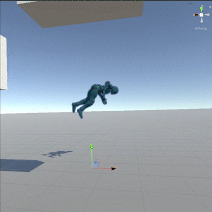

  

<h2 align="center">
  PhysAnim for Unity
</h2>

**PhysAnim** is a Unity tool that enables physical animation through motor-based and keyframe-based ragdoll pose matching.

  

---

## Quickstart Guide

### Installation

To add the package to your project:

1. Open the Unity Package Manager (`Window > Package Manager`).
2. Click **"Add package from Git URL"**, then paste the following repository URL:  
   [https://github.com/lenoctambule/PhysAnim-Unity.git](https://github.com/lenoctambule/PhysAnim-Unity.git)

---

### Usage

⚠ **Important**: Set your Animator’s **Culling Mode** to **"Always Animate"** and **Update Mode** to **"Animate Physics"**.

1. Add the **Pose Match** component (via `Add Component > PhysAnim > Pose Match`) to any GameObject that is **not** a parent of, or the object you want to physically animate.
2. Assign the root of the ragdoll to the **reference field**.
3. Add a **Ragdoll Profile** component (via `Add Component > PhysAnim > Ragdoll Profile`). If the **Pose Match** field isn't auto-filled, set it to the one you just created.
4. If your joints are **Character Joints**, you can convert them using the **"Convert Character Joints to Configurable Joints"** button.
5. Use **"Auto-detect and add character joints"** to populate the joint list, or add them manually.
6. Tweak the settings to your liking.

There are three modes:

- **Local** – Matches joint rotations locally using motor constraints.
- **Global** – Matches global positions and rotations using interpolation.
- **Global and Local** – Combines both approaches. :construction_worker: *(Under development)*

---

## Acknowledgments

- [Michal Mach – *Physics Animation in Uncharted 4: A Thief's End (GDC Talk)*](https://www.youtube.com/watch?v=7S-_vuoKgR4)  
- [Bartłomiej Waszak – *Physical Animation in Star Wars Jedi: Fallen Order (GDC Talk)*](https://www.youtube.com/watch?v=TmAU8aPekEo)  
- Michael Stevenson – for [ConfigurableJointsExtensions.cs](https://gist.github.com/mstevenson/7b85893e8caf5ca034e6)
